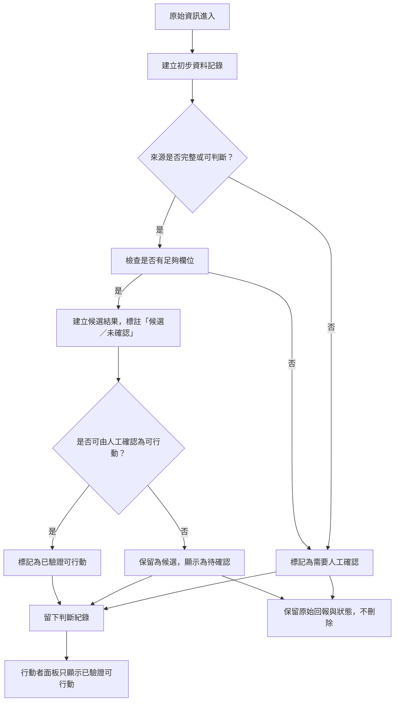

# 資訊流程設計

> 這份文件可以由 Codex 先產生草稿，但你必須用 VS Code 預覽 Mermaid，並由人檢查流程是否合理。

## 我的 v1 目標

- 我優先服務的使用者：資訊整理者。
- 這個使用者最想完成的事：在不改變原始資料真實性的前提下，將可以的候選資訊標記出來，並保留不完整或不確定資料供後續查核。
- 我最想避免的錯誤：把未確認或模糊的回報直接當成可行動任務。

## 自然語言流程描述

原始資訊進來後，系統先保留原文與來源標記，並為每筆資料建立初步狀態。
整理者先判斷來源可信度與內容是否完整，並把不完整、模糊或轉述型回報標記為「需要人工確認」。
當資訊不足以採取行動時，先不把它列為可行動候選，而是保留為待確認資料。
如果資訊有足夠關鍵欄位且看起來可以形成候選結果，仍要先以「候選結果」呈現，但保留「未確認」標籤，避免誤導行動者。
最後，只有當人工確認過並記錄判斷理由後，才把資料升級為「已驗證可行動」並顯示在行動者面板中。
每一次人工判斷都要留下誰審核、時間、以及為什麼這筆資料能或不能成為候選結果的記錄。

## Mermaid 流程圖

請讓 Codex 根據上面的自然語言描述產生 Mermaid。

請用 VS Code 預覽，確認流程圖能正常顯示。

## 人工確認點

- 當資料來源或內容不完整時，人工決定是否繼續保留為待確認資料。
- 當資料看似可形成候選結果時，人工決定這筆資料是否可以升級為「已驗證可行動」。
- 當資料從候選狀態轉為可行動狀態時，人工需要填寫審核理由與時間。

## 不能自動處理的分支

- 不應該由 AI 自動判定「資料來源是否可信」或「資訊是否足夠採取行動」。
- 不應該自動把不完整回報直接轉成可行動候選。

## 操作或判斷紀錄

- 需要記錄每筆資料的原始來源、初步狀態與標記原因。
- 需要記錄誰進行了人工確認、何時確認、以及確認結果與理由。
- 需要保留被標為「需要人工確認」或「待確認」的資料狀態，不應該直接刪除原始回報。

## 我檢查後修正了什麼

- 原本：流程只說「標示需要人工確認」，但沒有說明候選結果與行動者面板的區別。
- 修正後：加入「建立候選結果，標註『候選／未確認』」與「行動者面板只顯示已驗證可行動」的分支。
- 為什麼：避免讓行動者誤以為所有候選資料都可以直接採取行動。

## 我仍不確定的流程點

- 不確定是否要把「回報者可保留不完整資料」明確拆成兩種狀態：raw vs withdrawn。
- 不確定是否需要為每筆候選結果額外顯示「缺少哪些欄位」的詳細清單。
